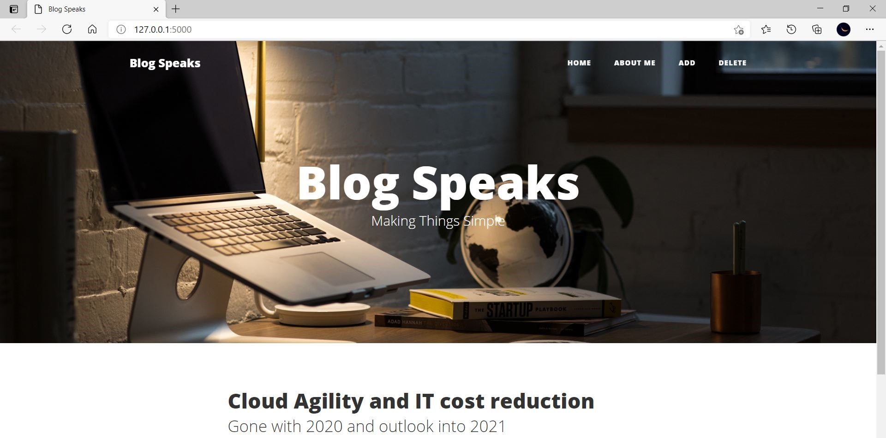

## Blog Space

RESTful webservice created using Python Flask and SQLite for a Blogging website.

### Installation Requirements

1. `pip install Flask`
2. `pip install Flask-SQLAlchemy`

### Web Application

### Steps of Code Execution

1. Clone / Download this [repository](https://github.com/Telomelonia/mlh_project)
2. Unzip the downloaded folder
3. Open any python editor (Here, [VS Code](https://code.visualstudio.com/) is used)
4. Run this [python file](https://github.com/Telomelonia/mlh_project/blob/main/app.py) and go to the link to execute the application.
